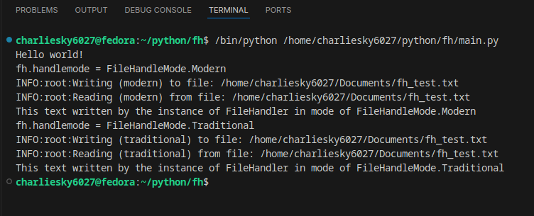

# 📘 FileHandler6027 Documentation

Welcome to the official documentation site for `filehandler6027`.

---

## ✨ Features

- Clean full-path construction using `~`
- JSON-style file read/write
- Traditional and Modern mode support

---

## 🚀 Quick Start

```bash
pip install filehandler6027
```

```python
from filehandler import FileHandler, FileHandleMode
```

---

## 📸 Terminal Screenshot



---

## 📜 Changelog

See [CHANGELOG.md](../CHANGELOG.md) for version history.
